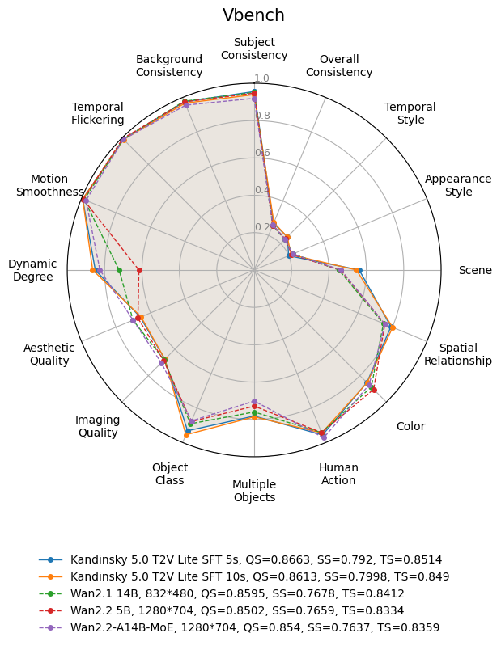

<div align="center">
  <picture>
    <source media="(prefers-color-scheme: dark)" srcset="assets/KANDINSKY_LOGO_1_WHITE.png">
    <source media="(prefers-color-scheme: light)" srcset="assets/KANDINSKY_LOGO_1_BLACK.png">
    
  </picture>
</div>

<div align="center">
  <a href="">Habr</a> | <a href=>Project Page</a> | Technical Report (soon) | <a href=https://huggingface.co/collections/ai-forever/kandisnky-50-t2v-lite-68d71892d2cc9b02177e5ae5> Models🤗 </a>
</div>

<h1>Kandinsky 5.0 Video: A family of diffusion models for Video generation</h1>

In this repository, we provide a family of diffusion models to generate a video given a textual prompt or an image (<em>Coming Soon</em>) and distilled model for a faster generation.

https://github.com/user-attachments/assets/b9ff0417-02a4-4f6b-aacc-60c44e7fe6f1

## Project Updates

- 🔥 **Source**: ```2025/09/29```: We have open-sourced `Kandinsky 5.0 T2V Lite` a lite (2B parameters) version of `Kandinsky 5.0 Video` text-to-video generation model. Released checkpoints: `lite_pretrain_5s`, `lite_pretrain_10s`, `lite_sft_5s`, `lite_sft_10s`, `lite_nocfg_5s`, `lite_nocfg_10s`, `lite_distil_5s`, `lite_distil_10s` contains weight from pretrain, supervised finetuning, cfg distillation and distillation in 16 steps. 5s checkpoints are capable of generating videos up to 5 seconds long. 10s checkpoints is faster models checkpoints trained with [NABLA](https://huggingface.co/ai-forever/Wan2.1-T2V-14B-NABLA-0.7) algorithm and capable to generate videos up to 10 seconds long.

## Kandinsky 5.0 T2V Lite

Kandinsky 5.0 T2V Lite is a lightweight video generation model (2B parameters) that ranks #1 among open-source models in its class. It outperforms larger Wan models (5B and 14B) and offers the best understanding of Russian concepts in the open-source ecosystem.

We provide 8 model variants, each optimized for different use cases:

* SFT model — delivers the highest generation quality;

* CFG-distilled — runs 2× faster with minimal quality loss;

* Diffusion-distilled — enables low-latency generation;

* Pretrain model — designed for fine-tuning by researchers and enthusiasts.

All models are available in two versions: for generating 5-second and 10-second videos.

## Model Zoo

| Model                               | config | video duration | NFE | Checkpoint | Latency* (H100) | VBench score |
|-------------------------------------|--------|----------------|-----|------------|----------------|--------------|
| Kandinsky 5.0 T2V Lite SFT 5s       | ./configs/config_5s_sft.yaml | 5s             | 100 |🤗 [HF](https://huggingface.co/ai-forever/Kandinsky-5.0-T2V-Lite-sft-5s) |      139 s     |     84.02    |
| Kandinsky 5.0 T2V Lite SFT 10s      |./configs/config_10s_sft.yaml| 10s            | 100 |🤗 [HF](https://huggingface.co/ai-forever/Kandinsky-5.0-T2V-Lite-sft-10s) |      224 s     |     85.36    |
| Kandinsky 5.0 T2V Lite pretrain 5s  |./configs/config_5s_pretrain.yaml | 5s             | 100 |🤗 [HF](https://huggingface.co/ai-forever/Kandinsky-5.0-T2V-Lite-pretrain-5s) |      139 s      |              |
| Kandinsky 5.0 T2V Lite pretrain 10s |./configs/config_10s_pretrain.yaml | 10s            | 100 |🤗 [HF](https://huggingface.co/ai-forever/Kandinsky-5.0-T2V-Lite-pretrain-10s) |     224 s      |              |
| Kandinsky 5.0 T2V Lite no-CFG 5s    |./configs/config_5s_nocfg.yaml| 5s             | 50  |🤗 [HF](https://huggingface.co/ai-forever/Kandinsky-5.0-T2V-Lite-nocfg-5s) |                |              |
| Kandinsky 5.0 T2V Lite no-CFG 10s   |./configs/config_10s_nocfg.yaml| 10s            | 50  |🤗 [HF](https://huggingface.co/ai-forever/Kandinsky-5.0-T2V-Lite-nocfg-10s) |                |              |
| Kandinsky 5.0 T2V Lite distill 5s   |./configs/config_5s_distil.yaml| 5s             | 16  | 🤗 [HF](https://huggingface.co/ai-forever/Kandinsky-5.0-T2V-Lite-distilled16steps-5s)|       37 s     |              |
| Kandinsky 5.0 T2V Lite distill 10s  |        | 10s            | 16  |            |                |              |

*Latency was measured after the second inference run. The first run of the model can be slower due to the compilation process.

### Examples:

#### Kandinsky 5.0 T2V Lite SFT

<table cellspacing="0" cellpadding="0" style="border-collapse: collapse; border-spacing: 0;">
  <tr>
    <td style="padding: 0; margin: 0; line-height: 0;">
      <video width="384" height="256" controls>
        <source src="assets/generation_examples/sft/1.mp4" autoplay loop muted playsinline type="video/mp4">
      </video>
    </td>
    <td style="padding: 0; margin: 0; line-height: 0;">
      <video width="384" height="256" controls>
        <source src="assets/generation_examples/sft/2.mp4" autoplay loop muted playsinline type="video/mp4">
      </video>
    </td>
    <td style="padding: 0; margin: 0; line-height: 0;">
      <video width="384" height="256" controls>
        <source src="assets/generation_examples/sft/3.mp4" autoplay loop muted playsinline type="video/mp4">
      </video>
    </td>
  </tr>
  <tr>
    <td style="padding: 0; margin: 0; line-height: 0;">
      <video width="384" height="256" controls>
        <source src="assets/generation_examples/sft/4.mp4" autoplay loop muted playsinline type="video/mp4">
      </video>
    </td>
    <td style="padding: 0; margin: 0; line-height: 0;">
      <video width="384" height="256" controls>
        <source src="assets/generation_examples/sft/5.mp4" autoplay loop muted playsinline type="video/mp4">
      </video>
    </td>
    <td style="padding: 0; margin: 0; line-height: 0;">
      <video width="384" height="256" controls>
        <source src="assets/generation_examples/sft/6.mp4" autoplay loop muted playsinline type="video/mp4">
      </video>
    </td>
  </tr>
</table>

#### Kandinsky 5.0 T2V Lite Distill

<table cellspacing="0" cellpadding="0" style="border-collapse: collapse; border-spacing: 0;">
  <tr>
    <td style="padding: 0; margin: 0; line-height: 0;">
      <video width="384" height="256" controls>
        <source src="assets/generation_examples/distill/1.mp4" autoplay loop muted playsinline type="video/mp4">
      </video>
    </td>
    <td style="padding: 0; margin: 0; line-height: 0;">
      <video width="384" height="256" controls>
        <source src="assets/generation_examples/distill/2.mp4" autoplay loop muted playsinline type="video/mp4">
      </video>
    </td>
    <td style="padding: 0; margin: 0; line-height: 0;">
      <video width="384" height="256" controls>
        <source src="assets/generation_examples/distill/3.mp4" autoplay loop muted playsinline type="video/mp4">
      </video>
    </td>
  </tr>
</table>

### Results:

#### Side-by-Side evaluation
TODO: add SBS

#### VBench results

<div align="center">
  <picture>
    
  </picture>
</div>

## Quickstart

#### Installation
Clone the repo:
```sh
git clone TODO add actual repo
cd TODO add actual repo name
```

Install dependencies: # TODO add requirements.txt
```sh
pip install -r requirements.txt
```

#### Model Download
```sh
python download_models.py
```

#### Run Kandinsky 5.0 T2V Lite SFT 5s

```sh
python test.py --prompt "A dog in red hat"
```

#### Run Kandinsky 5.0 T2V Lite SFT 10s 

```sh
python test.py --config ./configs/config_10s_sft.yaml --prompt "A dog in red hat" --video_duration 10 
```

#### Run Kandinsky 5.0 T2V Lite pretrain 5s

```sh
python test.py --config ./configs/config_5s_pretrain.yaml --prompt "A dog in red hat"
```

#### Run Kandinsky 5.0 T2V Lite pretrain 10s

```sh
python test.py --config ./configs/config_10s_pretrain.yaml --prompt "A dog in red hat" --video_duration 10
```

#### Run Kandinsky 5.0 T2V Lite no-CFG 5s

```sh
python test.py --config ./configs/config_5s_nocfg.yaml --prompt "A dog in red hat" 
```

#### Run Kandinsky 5.0 T2V Lite no-CFG 10s

```sh
python test.py --config ./configs/config_10s_nocfg.yaml --prompt "A dog in red hat" --video_duration 10
```

#### Run Kandinsky 5.0 T2V Lite distill 5s

```sh
python test.py --config ./configs/config_5s_distil.yaml --prompt "A dog in red hat"          
```

#### Run Kandinsky 5.0 T2V Lite distill 10s

```sh
TODO: add example
```

### Inference

```python
import torch
from IPython.display import Video
from kandinsky import get_T2V_pipeline

device_map = {
    "dit": torch.device('cuda:0'), 
    "vae": torch.device('cuda:0'), 
    "text_embedder": torch.device('cuda:0')
}

pipe = get_T2V_pipeline(device_map)

images = pipe(
    seed=42,
    time_length=5,
    width=768,
    height=512,
    save_path="./test.mp4",
    text="A cat in a red hat",
)

Video("./test.mp4")
```

Please, refer to [inference_example.ipynb](inference_example.ipynb) notebook for more usage details.

### Distributed Inference

For a faster inference, we also provide the capability to perform inference in a distributed way:
```
NUMBER_OF_NODES=1
NUMBER_OF_DEVICES_PER_NODE=1 / 2 / 4
python -m torch.distributed.launch --nnodes $NUMBER_OF_NODES --nproc-per-node $NUMBER_OF_DEVICES_PER_NODE test.py
```

## 📑 Todo List
- Kandinsky 5.0 Lite Text-to-Video
    - [x] Multi-GPU Inference code of the 2B models
    - [ ] Checkpoints 2B models
      - [x]  pretrain
      - [x] sft
      - [ ] rl
      - [x] cfg distil 
      - [x] distil 16 steps
    - [x] ComfyUI integration
    - [ ] Diffusers integration
    - [ ] Caching acceleration support
- Kandinsky 5.0 Lite Image-to-Video
    - [ ] Multi-GPU Inference code of the 2B model
    - [ ] Checkpoints of the 2B model
    - [ ] ComfyUI integration
    - [ ] Diffusers integration
- Kandinsky 5.0 Pro Text-to-Video
    - [ ] Multi-GPU Inference code of the models
    - [ ] Checkpoints of the model
    - [ ] ComfyUI integration
    - [ ] Diffusers integration
- Kandinsky 5.0 Pro Image-to-Video
    - [ ] Multi-GPU Inference code of the model
    - [ ] Checkpoints of the model
    - [ ] ComfyUI integration
    - [ ] Diffusers integration

# Authors
<B>Project Leader:</B> Denis Dimitrov</br>

<B>Team Leads:</B> Vladimir Arkhipkin, Vladimir Korviakov, Nikolai Gerasimenko, Denis Parkhomenko</br>

<B>Core Contributors:</B> Alexey Letunovskiy, Maria Kovaleva, Ivan Kirillov, Lev Novitskiy, Denis Koposov, Dmitrii Mikhailov, Anna Averchenkova, Andrey Shutkin, Julia Agafonova, Olga Kim, Anastasiia Kargapoltseva, Nikita Kiselev</br>

<B>Contributors:</B> Anna Dmitrienko,  Anastasia Maltseva, Kirill Chernyshev, Ilia Vasiliev, Viacheslav Vasilev, Vladimir Polovnikov, Yury Kolabushin, Alexander Belykh, Mikhail Mamaev, Anastasia Aliaskina, Tatiana Nikulina, Polina Gavrilova</br>
